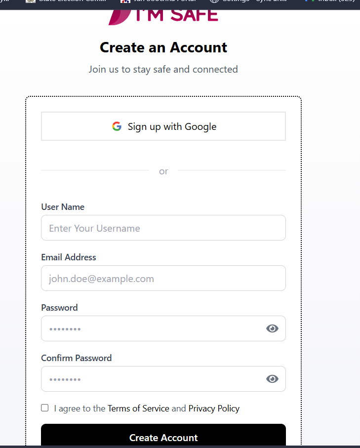
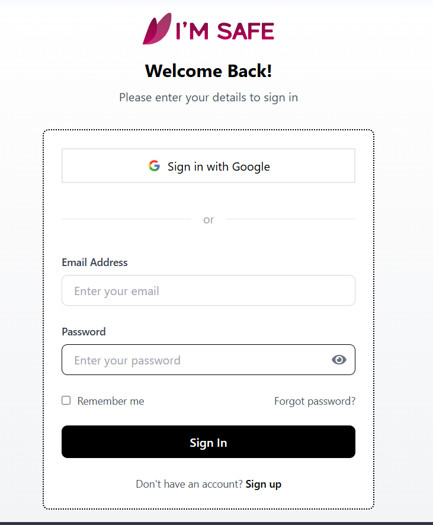
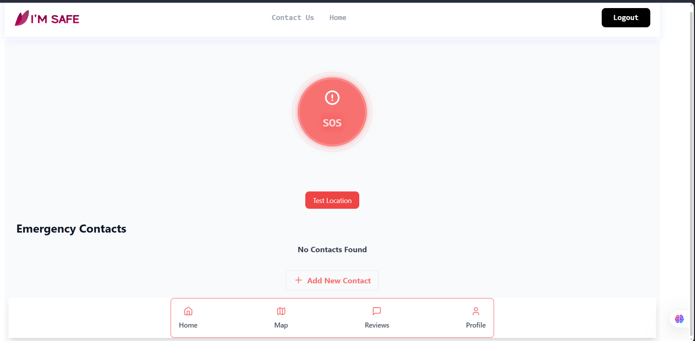
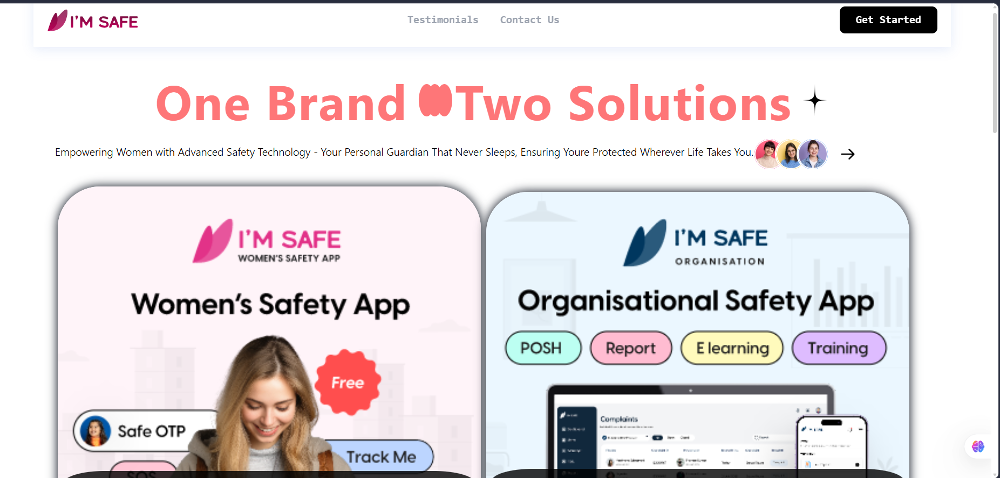
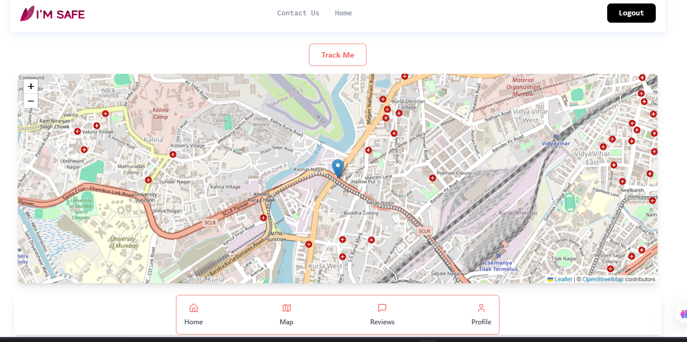
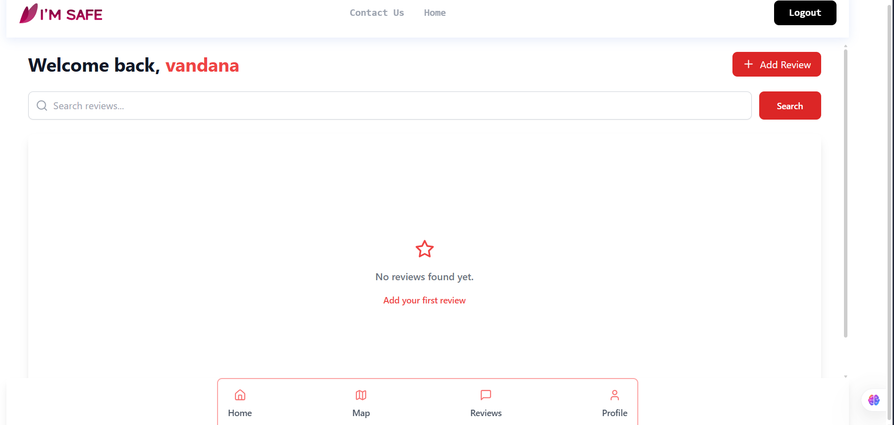

# Women Safety App

A full-stack Women Safety Web Application that allows users to send SOS alerts with real-time location to emergency contacts.

## Features

- User Signup and Login
- SOS Emergency Alert
- Real-Time Location Tracking
- Emergency Contact Management
- Profile Photo Upload
- Cloudinary Image Storage

## Tech Stack

Frontend
- React
- Tailwind CSS
- Axios

Backend
- Node.js
- Express.js

Database
- MongoDB

Other Tools
- Cloudinary
- Fast2SMS (for emergency alerts)

## Application Screenshots

### Login Page
User authentication page where existing users can log into the Women Safety System.

---

### Signup Page
New users can create an account by entering their details securely.

---

### Homepage
Central dashboard where users can access the SOS button, emergency contacts, and safety tools.

---

### Main Dashboard
The landing page of the application showing navigation and main safety features.

---

### Add Contact Popup
Users can add trusted emergency contacts with name, number, and profile photo.

---

### Map Location Feature
Displays the user's real-time location to assist emergency contacts.

---

### Reviews Section
Users can share safety feedback and view reviews within the application.

